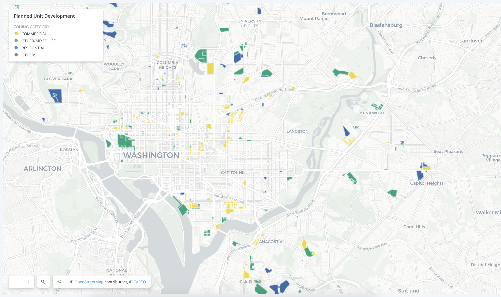

# Creating Zoning Maps Using Python & Pandas
Sophie Spiliotopoulos
Lab 4, Due Nov 13

This lab used Python and Pandas to analyze dataframes from [OpenData D.C.](https://opendata.dc.gov/). Using both `pandas` and `geopandas`, I merged the a affordable housing `.csv` with a the planned urban development (PUD) data. I used these two datasets to plot where PUDs existed within affordable housing areas. I created a map representing this within Carto, which you can check  out [here](https://sophspilio.carto.com/builder/2aa780e7-ff86-45ac-bd2d-3f6344e14d23/embed) 

